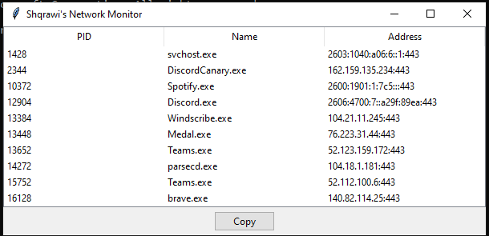

# Shqrawi's Network Monitor

## Description
This Network Monitor is a simple Python application that allows you to monitor network connections and retrieve information about processes with established connections. It provides a graphical user interface (GUI) that displays the process ID, name, and the remote address of each established connection.

The application uses the `psutil` library to interact with the system processes and retrieve network connection information.

## Features
- Displays a list of processes with established network connections.
- Shows the process ID, name, and remote address (IP:Port) for each connection.
- Copies the selected remote address to the clipboard with a single click.

## Prerequisites
- Python 3.x
- `psutil` library (can be installed via `pip install psutil`)
- `tkinter` library (usually included with Python)

